# DIH-Cell-Augmentor
A setup for augmentation of biological cells captured via Digital Inline Holography

# Method
* Load dataset, having images grouped under labels
* Augment cell sample by rotation at specific angle
* Store augmented images in a csv

# Augmentation Procedure
* Create a mask to extract the cell background
* Negate the above mask to extract the cell 
* Rotate the image by specified degree, achieved via `getRotationMatrix2D` and `warpAffine` functions in cv2
* Extract the rotated cell signature using the negated mask
* Mask it with the extracted cell background to create an augmented image, with same shape as original image

Note: The code is applicable only for augmentation of objects/cells lying within the maximum fitting circle which can be fit into the image

# Pre-requisites:
* cv2
* glob, or alternatively use os
* numpy

# Demo:
Note: Black dot has been added for easier vizualization

## Input Image: 
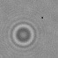

## Augmented Images:
Augmented Images on rotation by 0, 10, 20, 30,.....,350 degrees :

|   |     |   |
|------------|-------------|
|   | 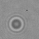 | 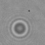 |
| 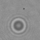 | 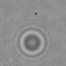 | 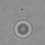 |
| 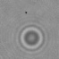 | 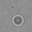 | 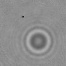 | 
| 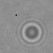 | 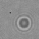 | 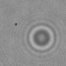 |
| 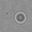 | 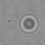 | 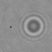 |
| 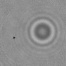 | 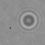 | 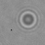 |
| 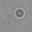 | 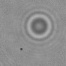 | 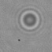 |
| 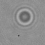 | 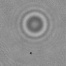 | 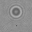 |
| 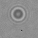 | 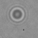 | 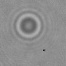 |
| 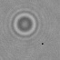 | 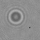 | 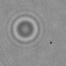 |
| 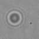 | 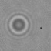 | 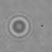 |
| 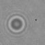 | 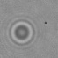 | 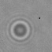 |
